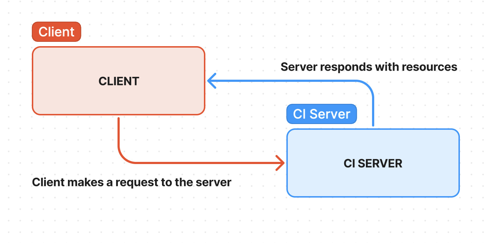

# Basic-Express-Server
Dynamic API Phase 1: Build your core, standards compliant Express server

### [Render URL](https://basic-express-server-92a3.onrender.com/)
https://basic-express-server-92a3.onrender.com/
### Author: Evan Cheng
### Version: 1.0.0

### Project Overview
This Express server application features a robust and well-organized structure, ideal for efficient web service development. The server includes a designated /person endpoint, which processes incoming requests that include a name property in the query string.

### Key Components
#### /person Route

    This endpoint expects a query string containing the name property. If the name is provided, the server responds with a JSON object encapsulating the name. If the name parameter is absent, the server issues an error message, enhancing API usability by guiding the user towards correct usage.

#### Server Initialization  

    Managed within an index file, this component sets up and configures the server, preparing it for incoming requests.

#### Middleware Modules

    1. Logging: Captures and logs request data, aiding in      debugging and monitoring server operations.

    2. Input Validation: Ensures that incoming requests meet the expected format, enhancing security and data integrity.

#### Error Handling Modules
  
    404 Responses: Handles requests to non-existent routes, informing users that the requested endpoint could not be found.
  
    500 Responses: Manages internal server errors, providing a fallback mechanism to prevent server crashes and maintain uptime.

### Design Philosophy
The architecture of this server prioritizes clean structure and separation of concerns, ensuring each component is independently manageable and scalable. This modular design not only facilitates easier maintenance but also promotes reusable code across different parts of the application or even across different projects.  

### UML
